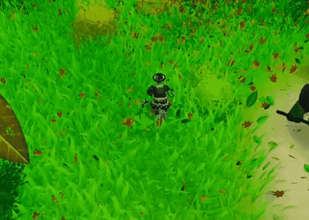
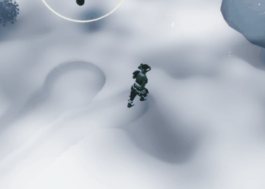

<!-- BANNER -->

  

<h1 align="center">Roguelike Game Prototype</h1>

  <b>A Graduation Project developed at VTC Academy</b>

  <a href="YOUR_BUILD_LINK">▶️ Play Game</a> •
  <a href="YOUR_TRAILER_LINK">🎥 Trailer</a>

  
  
  
  

---

## 👋 Introduction

This repository is a fork of a team-developed Unity project, adapted to highlight my individual contributions and technical perspective as a gameplay programmer.

The project is a **roguelike prototype** featuring two gameplay modes: **top-down action** and **turn-based mechanics**.

My work focuses specifically on the **top-down gameplay mode**, where I was responsible for implementing core gameplay systems, designing interactions, and enhancing overall game feel through visual and audio feedback.

I focused on building **scalable gameplay systems using event-driven and pattern-based design**, while also improving player experience through responsive controls and immersive feedback.

> 🔍 This repository is intended as a portfolio piece to demonstrate my gameplay programming and system design skills.

---

## 📚 Table of Contents

* [About The Project](#-about-the-project)
* [Gameplay Preview](#-gameplay-preview)
* [Key Features](#-key-features-top-down-mode)
* [My Contribution](#-my-contribution)
* [Technical Challenges & Observations](#-technical-challenges--observations)
* [Proposed Improvements](#-proposed-improvements)
* [Tech Stack](#️-tech-stack)
* [Design Approach & Patterns](#-design-approach--patterns)
* [What I Learned](#-what-i-learned)

---

## 📌 About The Project

This is a **roguelike game prototype** developed in Unity as part of a team project.

The game includes two main gameplay modes:

* **Top-down action mode** (real-time combat)
* **Turn-based mode** (strategic gameplay)

My contribution is focused entirely on the **top-down gameplay experience**.

* Genre: Roguelike
* Role: Gameplay Programmer (Top-down mode)
* Focus: Combat systems, interaction, and game feel

(<a href="#readme-top">back to top</a>)

---

## 🖼️ Gameplay Preview

<b>** ComboAttack **</b>

  

<b>** Skills, Weather And Maps **</b>

  
  
  

<b>** Enviroment Details **</b>

  
  

<b>** Boss Fight **</b>

  
  
  

(<a href="#readme-top">back to top</a>)

---

## ✨ Key Features (Top-Down Mode)

* Combo-based combat system

* Responsive player input handling

* Player-controlled camera system

* **Hierarchical State Machine (Player & Enemy AI)**
  Structured and scalable state transitions for gameplay behaviors

* **Enemy AI System**

  * Pathfinding & obstacle avoidance using NavMesh + CharacterController
  * Dynamic separation to prevent clustering
  * Context-aware move selection based on distance
  * Ranged enemy positioning (kiting behavior)
  * Boss phase-based abilities

* **Skill System (30+ skills)**
  Strategy-based design for scalable and extendable behaviors

* **Item System (~10 types)**
  Reusable and flexible item behavior structure

* **Event-driven gameplay (Event Bus)**
  Decoupled communication between systems

* **Object management (Factory + Object Pooling)**
  Efficient spawning and reuse of gameplay objects

* Dynamic environmental interaction

  * Grass reacts to nearby objects
  * Leaves are displaced on movement
  * Snow deforms based on position

* VFX-driven feedback (VFX Graph & Particle System)

* Integrated sound effects

* Gameplay UI for top-down mode

(<a href="#readme-top">back to top</a>)

---

## 👤 My Contribution

I was responsible for the design and implementation of the top-down gameplay mode.

### Gameplay Programming

* Combat system (combo-based attacks)
* Input handling and gameplay flow
* Responsive control system

### System Design

* HSM for player and enemy behaviors
* Strategy-based skill and item systems
* Event-driven communication (Event Bus)

### Environment Interaction

* Grass, leaves, and snow interaction systems

### Visual Effects

* VFX Graph and particle-based feedback

### Audio

* Integrated gameplay sound effects

### UI

* Gameplay UI for top-down mode

### Code Ownership

* `Assets/Scripts/`
* `Assets/LokiInspector/`

(<a href="#readme-top">back to top</a>)

---

## 🧠 Technical Challenges & Observations

### 1. Script Responsibility

Some scripts (including my own) handle multiple responsibilities, reducing maintainability.

### 2. System Coupling

Certain systems are tightly coupled, making them harder to extend or modify independently.

### 3. Combat Flow Complexity

Combat logic could benefit from a more structured and consistent state management approach.

### 4. VFX & Gameplay Coupling

Some visual effects are directly tied to gameplay logic, limiting flexibility and reuse.

(<a href="#readme-top">back to top</a>)

---

## 🚀 Proposed Improvements

* Apply SOLID principles more consistently
* Improve separation between systems
* Refactor combat logic into a clearer state structure
* Decouple VFX and gameplay logic
* Improve modularity and scalability

(<a href="#readme-top">back to top</a>)

---

## 🛠️ Tech Stack

* Unity
* C#
* VFX Graph
* Particle System

(<a href="#readme-top">back to top</a>)

---

## 🧩 Design Approach & Patterns

During development, I explored and applied multiple design patterns to improve system structure, scalability, and performance.

### 🧠 Core Architecture

* **Hierarchical State Machine (HSM)**
  Used to drive both player and enemy behaviors, enabling scalable and structured state transitions.

---

### 🧩 Gameplay Systems

* **Strategy Pattern (Skills & Items)**
  Used to implement flexible systems where behaviors are encapsulated and easily extendable.

---

### 📡 System Communication

* **Event Bus (Event-Driven Architecture)**
  Used extensively to decouple systems and allow flexible communication between gameplay components.

---

### ♻️ Performance & Resource Management

* **Object Pooling**
  Used to reuse frequently spawned objects such as VFX.

* **Flyweight + Factory-style approach**
  Used to manage shared data and centralize object creation across multiple pools.

---

### ⚠️ Reflection

While these patterns were applied based on my learning, I recognize that my implementations are still evolving and not fully optimized.

Areas for improvement include:

* clearer abstraction between systems
* more consistent use of design principles
* improving flexibility and reusability

This project represents my transition from writing functional code to designing more structured and scalable gameplay systems.

(<a href="#readme-top">back to top</a>)

---

## 🧠 What I Learned

* Designing scalable gameplay systems using patterns
* Building responsive real-time combat systems
* Using event-driven architecture to decouple systems
* Optimizing performance with object pooling
* Enhancing game feel through VFX and audio
* Thinking in terms of system design, not just implementation

(<a href="#readme-top">back to top</a>)

---

## ⭐ Support

If you find this project interesting, feel free to give it a ⭐!
